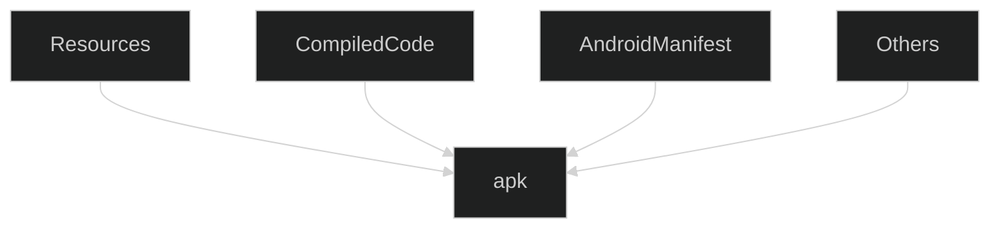

${toc}

# Introduction
- each app is a different user with a linux user id assigned by system which is unknown to app; 
	by default each app runs in its own linux process and each process has its own VM
	its possible to arrange two apps to have same user id so they can access each others files and share the same VM(they must be signed with same certificate)
- applications have an `Application` class which is declared in manifest(usually a project have predefined `Application` class but to use a custom `Application` class, we'll have to create it and declare it in manifest)
# Core App Components    
- entry points through which system or a user can enter the app
## Activities
- entry point for interacting with the user
- represents a user interface
- a different app can also start any of these activities
- usually implemented as subclass of `AppCompatActivity` class

## Services
- component that runs long running tasks, usually in the background.
- work manager is the thing for background tasks these day. Foreground services are ok.

## Broadcast Receivers

- enables the system to deliver events to the app outside of a regular user flow(respond to system-wide broadcast announcements)
- since these are another well defined entry in the app, system can deliver broadcast messages even if apps are note running
- many broadcasts originate from system. for example battery low, screen off, etc.
- apps can broadcast also, for example notifying some data is downloaded
- Don't display user interface but can create a status bar notification
- intended to do very minimal work
- implemented as subclass of `BroadcastReceiver` class

## Content Providers

- manages a shared set of app data that you can store in the file system, in a SQLite database, on the web, or on any other persistent storage location that your app can access
- Its an entry point into an app for publishing named data items, identified by a URI scheme and app can decide how it wants to map the data to a URI namespace
- URIs can persist after owning apps have exited, so it doesn't require the app to be running
- Provide fine-grained security model, for example an app attempts to access some URI, the system can this via a temporary URI permission grant. The app is allowed to access the data only behind that URI, but nothing else in the second app.
- implemented as subclass of `ContentProvider` class, must implement a standard set of APIs that enable other apps to perform transaction

# Activating components
- Activities, services and broadcast receivers are activated by an asynchronous message called `Intent`
- Intents bind individual components with each other at runtime, kind of messengers which request an action from other components(of same or different app)
- Content providers are activated when targeted by a request from a `ContentResolver`. This adds a layer of abstraction(for security)

## Intent
- explicit(with name of target activity) or implicit(with abstract descriptions of the operation to be performed)
- Intent Action: type of thing app want to have done on its behalf(like `ACTION_VIEW`, `ACTION_EDIT`)
- Intent Category: add a subtype the actions(like `CATEGORY_APP_EMAIL`, `CATEGORY_APP_CALENDAR`)
- example explicit intent
```kotlin
val downloadIntent = Intent(context, DownloadService::class.java).apply {
    data = Uri.parse(fileUrl)
}
```
- example implicit intent
```kotlin
val sendIntent = Intent().apply {
    action = Intent.ACTION_SEND
    putExtra(Intent.EXTRA_TEXT, textMessage)
    type = "text/plain"
}
```

- forcing an app chooser

```kotlin
val sendIntent = Intent(Intent.ACTION_SEND)
val title: String = resources.getString(R.string.chooser_title)
val chooser: Intent = Intent.createChooser(sendIntent, title)
if (sendIntent.resolveActivity(packageManager) != null) {
    startActivity(chooser)
}

```
- starting an activity

```kotlin
startActivity(
	Intent(
		requireContext(),
		MainActivity::class.java,
	).apply { 
		putExtra("some_useful_data", data)
	}
)
```
- starting an activity for result

```kotlin
var resultLauncher = registerForActivityResult(StartActivityForResult()) { result ->
    if (result.resultCode == Activity.RESULT_OK) {
        val data = result.data
        // do something with data
    }
}

fun openSomeActivityForResult() {
    val intent = Intent(this, OtherActivity::class.java)
    resultLauncher.launch(intent)
}

// In the OtherActivity
val i = Intent()
i.putExtra("useful_data", some_data)
setResult(Activity.RESULT_OK, i)
finish()
```
- **PendingIntent** 
	-  to grant permission to a foreign application to use the contained Intent as if it were executed from your app's own process.
	- usecases
		- declaring intent to be executed when clicking on a notification/widget
		- declaring intent to be executed later in future(using `AlarmManager`)

# Mainfest File

- `AndroidManifest.xml` file
    - declares app's components(application class, activities etc.)
    - indentifies any user permissions the app requires
    - declare the minimum API level required by the app
    - declare hardware and software features required by the app
    - Declares API libraries the app needs to be linked against (other than the Android framework APIs)
- activities, services and content providers can never run if not declared in the manifest, however, broadcast receivers can be created dynamically as `BroadcastReceiver` objects and received with the system by calling `registerReceiver()`
- declaring component capabilities
    - explicitly name the target component in intent OR
    - declare an intent-filter as a child of the component declaration for implicit intent
    - Do not declare intent filters for services, User cannot see which service starts and it can be a hazard to start a service by implicit intent.
```xml
<activity android:name=".MainActivity">
	<intent-filter>
		<action android:name="android.intent.action.MAIN" />
		<category android:name="android.intent.category.LAUNCHER" />
		<data android:mimeType="text/plain"/>
	</intent-filter>
</activity>
```
- declaring app requirements
    - system doesn't read them but extenal services such as Google Play do
        
    - `minSdkVersion` and `targetSdkVersion` are set in app module's `build.gradle` file, don't set these directly in the manifest file as they'll be overwritten during gradle build process
        
        ```
        android {
          ...
          defaultConfig {
            ...
            minSdkVersion 26
            targetSdkVersion 29
          }
        }
        ```
        
    - declaring camera feature required
        
        ```
        <manifest ... >
            <uses-feature android:name="android.hardware.camera.any"
                          android:required="true" />
            ...
        </manifest>
        
        ```
		
# Context
- gives information regarding activity and application
- `Activity` and `Application` classes extend `Context` class
-  can be used to get access to resources, databases, and shared preferences etc.
-  two types: application context(tied to application lifecycle) and activity context( tied to the lifecycle of an activity)


# Project Structure
- modules 
	- collection of source files and build settings to divide the project into discrete units of functionality
	- one module may use another module as a dependency
	- we can independently build, test, and debug each module.
	- useful when creating code libraries within your own project
	- types of modules
		- app module
		- feature module
		- library module(android library built to AAR/ java library build to JAR)
- file groups within each module
	- manifests
	- java/kotlin
	- res
- gradle files are shown in a top level group
- project structure on disk
```
build.gradle(project)
module-name/
	build/
	build.gradle(module)
	libs/
	src/
		androidTest/
		test/
		main/
			AndroidManifest.xml
			java/
			jni/
			gen/
			res/
			assets/(contains files that should be compiled in the apk as-is)
```

# Gradle
- What devices run the app
- Compile to android application package(apk)
- Dependencies
- App signing for Google Play
- Automated testing

<br><br>
- project contains two types of `build.gradle file`s:
	- for project wide build setting(in the root directory)
		```gradle
		buildscript {
			ext.kotlin_version = "1.5.0"
			repositories {
				google()
				mavenCentral()
			}
			dependencies {
				//since gradle is a general tool, to compile for android specifically, these are the dependencies
				classpath "com.android.tools.build:gradle:4.2.1"
				classpath "org.jetbrains.kotlin:kotlin-gradle-plugin:$kotlin_version"
			}
		}

		allprojects {
			repositories {
					google()
					mavenCentral()\
			}
		}

		task clean(type: Delete) {
			delete rootProject.buildDir
		}
		```
	- for each module(by default the app module in app folder)
		```gradle
		plugins {
			id 'com.android.application'
			id 'kotlin-android'
		}

		android {
			compileSdkVersion 30
			buildToolsVersion "30.0.3"

			defaultConfig {
				applicationId "com.artisticent.practice.diceroller"
				minSdkVersion 19
				targetSdkVersion 30
				versionCode 1
				versionName "1.0"

				testInstrumentationRunner "androidx.test.runner.AndroidJUnitRunner"
			}

			buildTypes {
				release {
					minifyEnabled false
					proguardFiles getDefaultProguardFile('proguard-android-optimize.txt'), 'proguard-rules.pro'
				}
			}
			compileOptions {
				sourceCompatibility JavaVersion.VERSION_1_8
				targetCompatibility JavaVersion.VERSION_1_8
			}
			kotlinOptions {
				jvmTarget = '1.8'
			}
		}

		dependencies {
			implementation "org.jetbrains.kotlin:kotlin-stdlib:$kotlin_version"
			implementation 'androidx.core:core-ktx:1.6.0'
			implementation 'androidx.appcompat:appcompat:1.3.0'
			implementation 'com.google.android.material:material:1.4.0'
			implementation 'androidx.constraintlayout:constraintlayout:2.0.4'
			testImplementation 'junit:junit:4.+'
			androidTestImplementation 'androidx.test.ext:junit:1.1.3'
			androidTestImplementation 'androidx.test.espresso:espresso-core:3.4.0'
		}
		```


# Logging
- log types: verbose(all), debug, info, warn, error, assert
- Logging library Timber setup:
	- add the dependecies to gradle module build file
	- create an application class and add this to its onCreate method
	```kotlin
	Timber.plant(Timber.debugTree())
	```
	- in the manifest file setup the application name property
	```xml
	<application android:name=".ApplicationClassName">
	```
	- to log with the  library
	```kotlin
	Timber.i("message to log")
	```