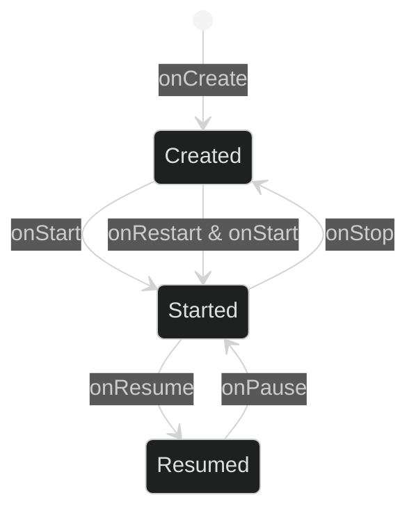
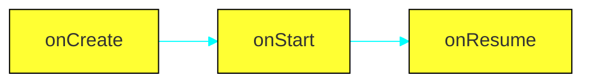
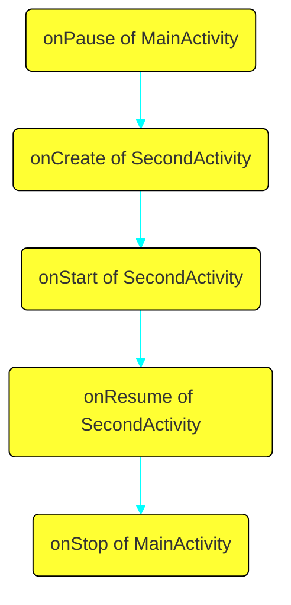
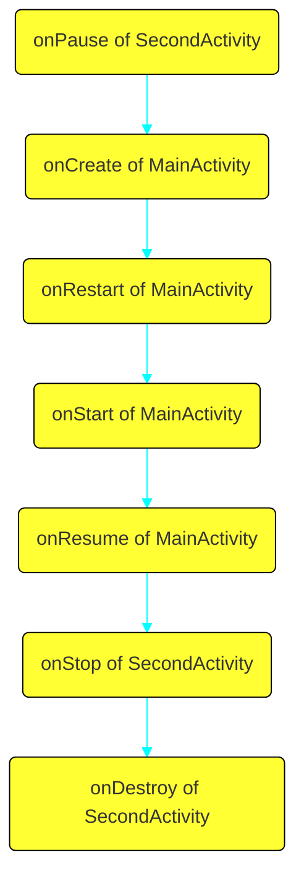
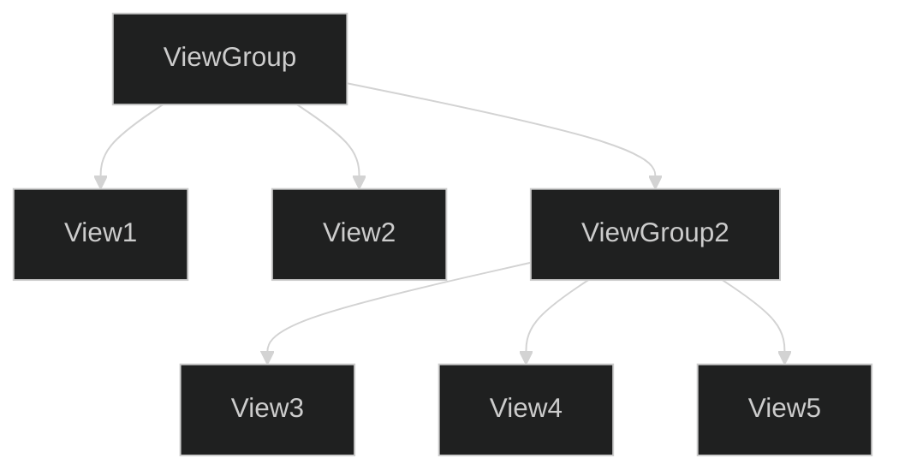
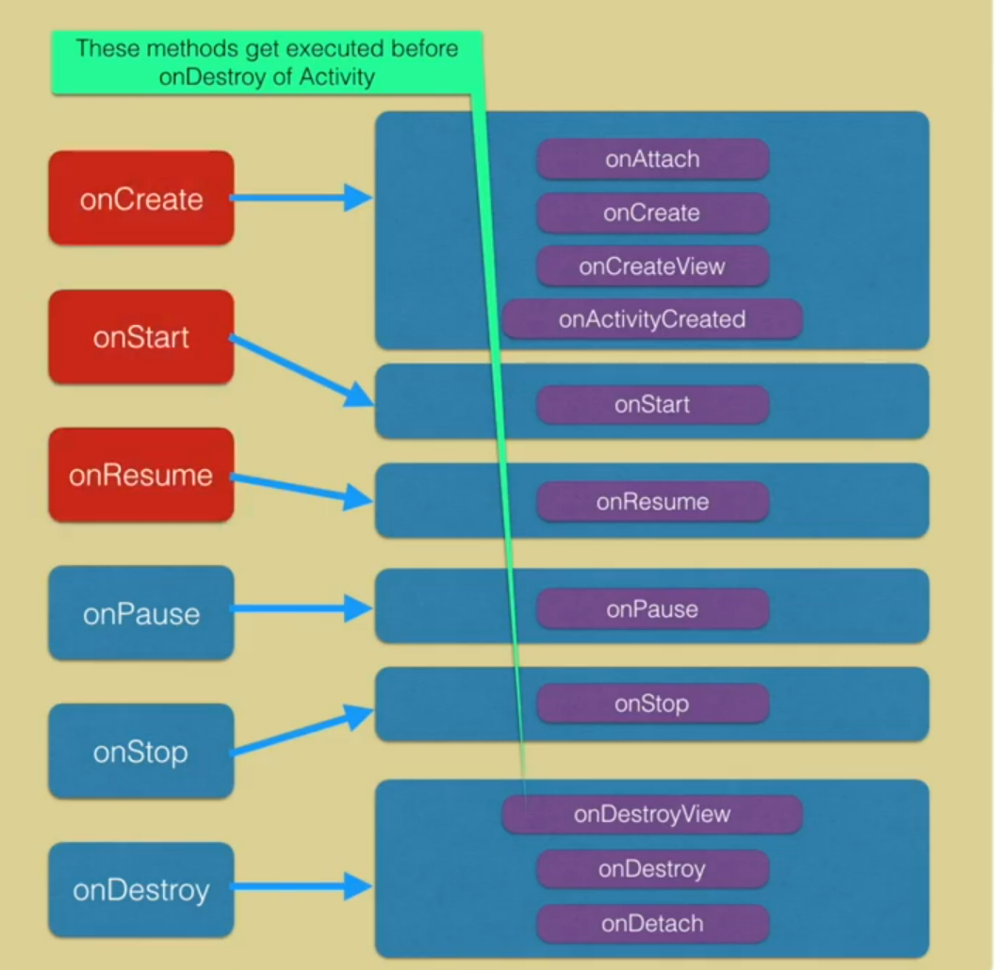

- [Activity states](#activity-states)
    - [when lifecycle methods are called](#when-lifecycle-methods-are-called)
- [LifeCycle Observers](#lifecycle-observers)
    - [To save data for when OS shuts down the app](#to-save-data-for-when-os-shuts-down-the-app)
    - [Activity launch modes](#activity-launch-modes)
- [Android User Interface](#android-user-interface)
- [Data Binding](#data-binding)
    - [Binding Data](#binding-data)
- [Dialogs, Toasts & Snackbars](#dialogs-toasts-snackbars)
- [Fragments](#fragments)
- [Navigation with fragments](#navigation-with-fragments)
    - [SafeArgs argument passing](#safeargs-argument-passing)
    - [Adding animated transitions](#adding-animated-transitions)
- [Action Bar](#action-bar)
    - [implementing up button](#implementing-up-button)
    - [Adding an overflow menu(three dots)](#adding-an-overflow-menuthree-dots)
    - [Adding a drawer](#adding-a-drawer)
- [Some other things](#some-other-things)

# Activity states



- `onCreate` first time creation(like constructor)
- `onStarted` just before activity is visible
- `onResume` just before activity is interactable

## when lifecycle methods are called

lets say we have two activities `MainActivity` & `SecondActivity`

- when `MainActivity` is first time opened



- switching from `MainActivity` to `SecondActivity`



- switching back to `MainActivity` with back button



- when user permission dialog or share dialog appears `onPause` is called
- `onPause` is useful for apps like youtube, we pause the playback when we cannot interact with the UI even if its visible

# LifeCycle Observers

```
class SomeTimer(lifecycle: Lifecycle): LifecycleObserver {
    init {
        lifecycle.addObserver(this)
    }
    @OnLifecycleEvent(Lifecycle.Event.ON_START)
    fun startTimer(){
        ////
    }
    @OnLifecycleEvent(Lifecycle.Event.ON_STOP)
    fun stopTimer(){
        ////
    }
}
```

- in `MainActivity.kt`

```
var timer = DessertTimer(this.lifecycle)
```

## To save data for when OS shuts down the app

- use on onSaveInstantState & onRestoreInstantState

```
override fun onSaveInstanceState(outState: Bundle) {
    super.onSaveInstanceState(outState)
    outState.putInt("key_revenue", revenue)
}
```

- configuration changes like rotation, changing language etc. causes OS to rebuild the activity(destroy and create)

## Activity launch modes

- defined in manifest

```xml
<activity android:name=”.MainActivity”
android:launchMode=”singleTop”></activity>
```

- singleTop, singleTask, singleInstance, standard

# Android User Interface



- `ViewGroup` is just an invisible container, usually called layout
- `View`s are called widgets
- these can be declared in XML file or at the runtime programmatically(Layout Inspector for debugging layout)
- XML file must contain one and only one root element
- XML layout file in compiled into a `View` source.
- to set a layout as ui for an activity

```kotlin
fun onCreate(savedInstanceState: Bundle) {
    super.onCreate(savedInstanceState)
    setContentView(R.layout.main_layout)//R for resource
}
```

- The id of a View object is defined as string in XML file but stored as integer

```xml
<--in XML file defining id-->
android:id="@+id/my_button"
```

```kotlin
//in kotlin file to access the View object
val myButton: Button = findViewById(R.id.my_button)
```

- An ID need not be unique throughout the entire tree, but it should be unique within the part of the tree you are searching (which may often be the entire tree, so it's best to be completely unique when possible)
    
- the `binding` feature can replace `findViewById()` calls
    
- Every ViewGroup class implements a nested class that extends `ViewGroup.LayoutParams`. This subclass contains property types that define the size and position for each child view, as appropriate for the view group.
    
    
- every LayoutParams subclass has its own syntax for setting values so child must define LayoutParams appropriate for its parents
    
- All view groups include a `layout_width` and `layout_height`, and each view is required to define them
    
- density-independent pixel units (dp), wrap\_content, or match\_parent, are better approach for defining these because it helps ensure that your app will display properly across many screen size
    
- sp(scale-independent pixel) is for fonts and for anything else use dp
    
- The density independent pixel is equivalent to one physical pixel on a 160 dpi screen
    

# Data Binding

- modify module gradle file and sync

```
android {
    ...
    buildFeatures {
        dataBinding true
    }
}
```

- then in the layout file

```xml
<?xml version="1.0" encoding="utf-8"?>
<layout xmlns:namespace="nsURI">
    <data>
        
    </data>
    <!--The root view element-->
    <LinearLayout>
        ...
    </LinearLayout>
</layout>
```

- then in activity source code

```kotlin
class MainActivity : AppCompatActivity() {
    //activity layout activity_main.xml so type is ActivityMainBinding
    private lateinit var binding: ActivityMainBinding
    override fun onCreate(savedInstanceState: Bundle?) {
        super.onCreate(savedInstanceState)
        binding = DataBindingUtil.setContentView(this, R.layout.activity_main)
        binding.runButton.setOnClickListener........
    }
}
```

## Binding Data

- create a data class(it doesn't have to be a data class always)

```kotlin
data class User(val firstName:String, val lastNameL:String)
```

- in activity's XML layout's `data` tag

```xml
<data>
    <!--Data goes here; name for reference; type for class type-->
    <variable name="user" type="com.example.trivia.User"/>
<data/>
```

- using variable in activity file

```kotlin
binding.user = User("Rahul", "Gill")
```

- using variable in layout file

```xml
<TextView android:text="@{user.firstName}" />
<!--or-->
<TextView android:text="@={user.firstName}" />
```

# Dialogs, Toasts & Snackbars

```kotlin
Toast.makeText(activity, "Toast made",Toats.LENGTH_LONG).show()
```

```kotlin
val dialog = AlertDialog.Builder(this.activity)
    .setTitle("Show AAA or BBB")
    .setIcon(R.drawable.icon_for_dialog)
    .setMessage("this dialog is just for showing off")
    .setPositiveButton("AAA"){ _, _ ->
        Toast.makeText(this.activity, "aaaaaaaaaa!", Toast.LENGTH_LONG).show()
    }.setNegativeButton("BBB"){ _, _ ->
        Toast.makeText(this.activity, "bbbbbbbbb!", Toast.LENGTH_LONG).show()
    }.create()
binding.dialogButton1.setOnClickListener{ dialog.show() }
```

```kotlin
Snackbar.make(binding.coordLayout, "woah",Snackbar.LENGTH_LONG).also{ snackbar ->
  snackbar.setAction("OK"){
      snackbar.dismiss()
  }
}.show()
```

# Fragments

```kotlin
//TitleFragment class
override fun onCreateView(
    inflater: LayoutInflater, 
    container: ViewGroup?,
    savedInstanceState: Bundle?
): View? {
    val binding: FragmentTitleBinding = DataBindingUtil.inflate(
        inflater, 
        R.layout.fragment_title, 
        container, 
        false
    )
    return binding.root
}
```

- to add a fragment to activity

```xml
<!-to show a fragment in the activity layout-->
<fragment
    android:id="@+id/main_fragment"
    android:name="com.example.app.mainFragment"
    android:layout_width="match_parent"
    android:layout_height="match_parent" />
<!-a navHost fragment which can show multiple fragments with the provided navGraph-->
<fragment
    android:id="@+id/navHostFragment"
    android:name="androidx.navigation.fragment.NavHostFragment"
    android:layout_width="match_parent"
    android:layout_height="0dp"
    app:defaultNavHost="true"
    app:navGraph="@navigation/navigation_graph" />
```

- why use fragments
    - reusability
    - easier when creating app for both phone and tablet
    - swipe interfaces with ViewPager are easier
    - data passing is easier
- fragment's lifecycle is closely related to the lifecycle of its host activity
- fragment lifecycle states
    

# Navigation with fragments

- Three principles:
    
    - A fixed starting destination(login is one exception)
    - LIFO backstack saving states
    - back button on screen and on app bar work the same
- Adding Navigation
    
    - add dependecies
    - create a navigation graph xml file
    - add the navHost fragment in the activity layout
    - declare the navGraph property of navHost fragment `app:navGraph="@navigation/navigation"`
    - Add fragments to navigation graph
    - make the button to navigation using safeargs
    
    ```kotlin
    //in onCreateView of fragment
    binding.playButton.setOnClickListener { v: View ->
    v.findNavController()
        .navigate(TitleFragmentDirections.actionTitleFragmentToGameFragment())
    }
    ```
    
- to pop some fragments from backstack when navigating to a fragment, use the `pop` property in current fragment xml file(inclusive will also remove the fragment named in the pop property)
    

## SafeArgs argument passing

- add the safeargs gradle plugin to dependencies

```kotlin
//in project gradle build file dependencies
classpath "androidx.navigation:navigation-safe-args-gradle-plugin:$version_navigation"
//in module gradle build file
apply plugin: 'androidx.navigation.safeargs.kotlin'
```

- in navigation xml file setup arguments for the fragment
- then when navigating to a fragment with arguments add this to current fragment class

```kotlin
this.findNavController()
    .navigate(currentFragmentDirections.withArgumentsFragment(arg1val, arg2val))
```

- to retrieve the fragment passed args

```kotlin
val args: ConfirmationFragmentArgs by navArgs()
override fun onViewCreated(view: View, savedInstanceState: Bundle?) {
    val arg1 = args.arg1val
    val arg2 = args.arg2val
}
```

## Adding animated transitions

- create an animation resource file

```xml
<set xmlns:android="http://schemas.android.com/apk/res/android">
    <alpha
        android:duration="@android:integer/config_mediumAnimTime"
        android:fromAlpha="0.0"
        android:toAlpha="1.0" />
</set>
```

- other example

```xml
<set xmlns:android="http://schemas.android.com/apk/res/android">
    <translate
        android:duration="@android:integer/config_shortAnimTime"
        android:fromXDelta="-100%"
        android:fromYDelta="0%"
        android:toXDelta="0%"
        android:toYDelta="0%" />
</set>
```

- add these to navigation graph file

# Action Bar

## implementing up button

```kotlin
override fun onCreate(savedInstanceState: Bundle?) {
    ...
    val navController = this.findNavController(R.id.myNavHostFragment)
    NavigationUI.setupActionBarWithNavController(this, navController, drawerLayout)
    ...
}
override fun onSupportNavigateUp(): Boolean {
    val navController = this.findNavController(R.id.myNavHostFragment)
    return navController.navigateUp() || super.onNavigateUp()
}
```

## Adding an overflow menu(three dots)

- add a menu resource file witg items which id is same as the fragment class name(for `AboutFragment` set it to `aboutFragment`) to which the menu item will navigate to
- to show the menu only in `TitleFragment` we'll have to

```kotlin
override fun onCreateView(
    inflater: LayoutInflater, container: ViewGroup?,
    savedInstanceState: Bundle?
): View {
    ...
    setHasOptionsMenu(true)
    ...
}
override fun onCreateOptionsMenu(menu: Menu, inflater: MenuInflater) {
    super.onCreateOptionsMenu(menu, inflater)
    inflater.inflate(R.menu.overflow_menu, menu)
}
override fun onOptionsItemSelected(item: MenuItem): Boolean {
    return NavigationUI.onNavDestinationSelected(
        item, 
        requireView().findNavController()
    ) || super.onOptionsItemSelected(item)
}
```

## Adding a drawer

- add the material design dependencies
- add the drawer menu resource
- add some items and set their ids as we did for the overflow menu
- using the drawer will change `activity_main.xml` this way

```xml
<layout xmlns:namespace="https://url.of.namespace.com/">
    <androidx.drawerLayout.widget.DrawerLayout
        id="@+id/drawerLayout">
        <LinearLayout ...>
            <fragment .../>
        </LinearLayout>
        <com.google.android.material.navigation.NavigationView
            android:id="@+id/navView"
            android:width="wrap_content"
            android:height="match_parent"
            android:menu="@menu/the_menu_resource_we_created_earlier.xml"
        />
    </androidx.drawerLayout.widget.DrawerLayout>
</layout>
```

- then in MainActivity.kt

```kotlin
val drawer = binding.drawerLayout
NavigationUI.setupActionBarWithNavController(this, navController, drawerLayout)
NavigationUI.setupWithNavController(binding.navView, navController)
```

-also the onSupportNavUp method return changes to this(so that up button get replaced with drawer on start destination)

```kotlin
return NavigationUI.navigateUp(drawerLayout, navController)
```

- also an argument `app:headerLayout`(passed a layout) can be used for `com.google.android.material.navigation.NavigationView` to add a header to the drawer
    
- the swipe to open the drawer works even when not in start destination to prevent this
    
    - use `navigation listener`s which are interfaces with a single method which is called everytime we navigate.
    - in the activity, do this
    
    ```kotlin
    navController.addOnDestinationChangedListener { 
        nc: NavController, nd: NavDestination, bundle: Bundle? ->
            if (nd.id == nc.graph.startDestination) {
                    drawerLayout.setDrawerLockMode(DrawerLayout.LOCK_MODE_UNLOCKED)
            } else {
                    drawerLayout.setDrawerLockMode(DrawerLayout.LOCK_MODE_LOCKED_CLOSED)
            }
    }
    ```
    

# Some other things

- What is the difference between FragmentPagerAdapter vs FragmentStatePagerAdapter?
    
    - FragmentPagerAdapter: Each fragment visited by the user will be stored in the memory but the view will be destroyed. When the page is revisited, then the view will be created not the instance of the fragment.
    - FragmentStatePagerAdapter: Here, the fragment instance will be destroyed when it is not visible to the user, except the saved state of the fragment.
- What is the difference between adding/replacing fragment in backstack?
    
    - replace removes the existing fragment and adds a new fragment. This means when you press back button the fragment that got replaced will be created with its onCreateView being invoked. Whereas add retains the existing fragments and adds a new fragment that means existing fragment will be active and they wont be in 'paused' state hence when a back button is pressed onCreateView is not called for the existing fragment(the fragment which was there before new fragment was added).
    - In terms of fragment's life cycle events onPause, onResume, onCreateView and other life cycle events will be invoked in case of replace but they wont be invoked in case of add.
- Why is it recommended to use only the default constructor to create a Fragment
    
    - Because when a fragment is recreated for example when screen orientation changes, the system would have no idea what was passed in the argumentsof constructor
- How would you communicate between two Fragments?
    
    - using a shared viewmodel or the parent activity implementing a callback(when fragment A wants to send some message to fragment B, it does with the callback implemented by the activty)
    
    ```kotlin
    class ParentActivity : FragA.TextClicked {
        override fun sendMessage(text: String?) {
            val frag: FragB = getSupportFragmentManager().findFragmentById(R.id.fragment_b)
            frag.receiveMessage(text)
        }
    }
    class FragA : Fragment() {
        var mCallback: TextClicked? = null
        interface TextClicked {
            fun sendMessage(text: String?)
        }
    
        override fun onAttach(context: Context) {
            super.onAttach(context)
            mCallback = 
                try { activity as TextClicked } 
                catch (e: ClassCastException) {
                    throw ClassCastException(activity.toString()+ " must implement TextClicked")
                }
        }
        override fun onDetach() {
            mCallback = null //avoid leaking
            super.onDetach()
        }
    }
    class FragB : Fragment() {
        fun receiveMessage(message: String?) {
            //do something with the message
        }
    }
    
    ```
    
- What is retained Fragment?
    
    - By default, Fragments are destroyed and recreated along with their parent Activity’s when a configuration change occurs. Calling setRetainInstance(true) allows us to bypass this destroy-and-recreate cycle, signaling the system to retain the current instance of the fragment when the activity is recreated.
- What is the purpose of addToBackStack() while commiting fragment transaction?
    
    - By calling addToBackStack(), the replace transaction is saved to the back stack so the user can reverse the transaction and bring back the previous fragment by pressing the Back button. For more Learn from here
- What is the purpose of addToBackStack() while commiting fragment transaction?
    
    - By calling addToBackStack(), the replace transaction is saved to the back stack so the user can reverse the transaction and bring back the previous fragment by pressing the Back button