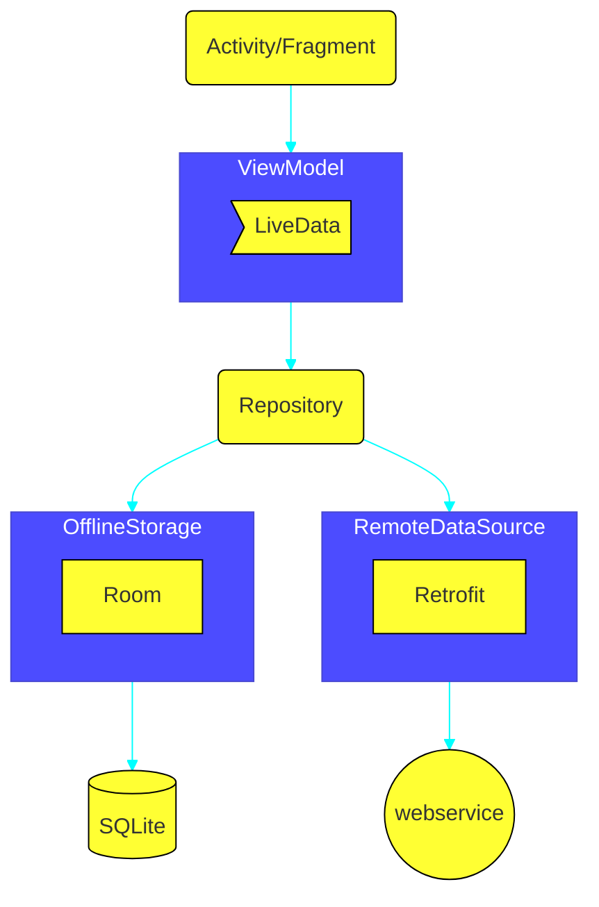

# MVVM
- model, view, view-model

- activity/fragment(UI controller) observers data from ViewModel
- LiveData is lifecycle aware of UI controller, so only updates UI when its in existance
- ViewModel contains UI data, repository provides it from the Data Models
# Adding ViewModel
- Add a class that extends ViewModel(GameFragment.kt  <-> GameViewModel.kt)
- add an object of this class in corresponding View class
```kotlin
class GameFragment: Fragment(){
	private lateinit viewModel: GameViewModel
	override fun onCreateView(...){
		...
		viewModel =  ViewModelProvider(this).get(GameViewModel::class.java)
	}
}
```

# Live Data for updating UI when values change
- define a live data object in ViewModel class
```kotlin
var score = MutableLiveData<Int>
```
- then in Fragment class
```kotlin
viewModel.score.observe(viewLifecycleOwner, { newScore ->
	binding.scoreText.text = newScore.toString()
})
```

# two way databinding with live data
```xml
<data>
	<variable
		name="viewmodel"
		type="com.example.rahulgill.mvvmapp.ui.auth.AuthViewModel" />
</data>
	<TextView
		text="@{viewmodel.textVar}"
	/>
	<Button
		onClick="@{viewmodel::aFunction}"

	/>
<!--in onClick you can also use @{() -> viemodel.aFunction()}-->
```
- then in Fragment or activity
```kotlin
val viewModel = ViewModelProvider(this).get(AuthViewModel::class.java)
binding.viewmodel = viewModel
binding.lifecycleOwner = this
```
- livedata without binding(if you need)
```kotlin
//in ViewModel
private var _score = MutableLiveData<Int>()
var score : LiveData<Int>
	get() = _score
//in activity/fragment

viewModel.score.observe(this,Observer{newscore -> 
	//lambda that tells what to do when score changes
} )
```
- things
	- ViewModel is created once. When the fragment/activity is destroyed, ViewModel still persists & when fragment/activity is recreated, the same ViewModel is used again. So phone rotation etc. won't affect workflow.
	- ViewModel doesn't contain reference to activity or fragment because what if they get destroyed and ViewModel still persists
	- `LiveData` is observed by fragments/activity, when its value changes, fragment/activity is notified. Also its lifeycle aware so when ui controller get destroyed, LiveData cleans up the connection to it and won't notify it when the data changes. To do this with data binding we've used the `binding.lifecycleOwner = this`
	- making live data mutable in ViewModel but unmutable in Fragment(so that only viewmodel can modify it)
	```
	private val _score = MutableLiveData<Int>()
	val score: LiveData<Int>
		get() = _score
	```
