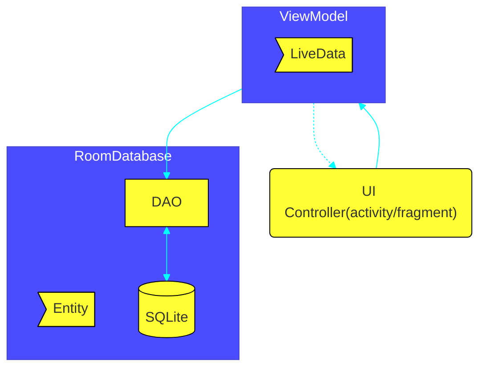

<br>

- **entity:** object or concept to store in the database;Entity class defines a table, each instance is stored as table row and properties on column
- **Query:** request for data retrieval or to perform some action
- **DAO:** data access object


### Steps for setting up Room Sqlite database
- create  a data class for database tables
```kotlin
@Entity(tableName = "daily_sleep_quality_table")
data class SleepNight(
	@PrimaryKey(autoGenerate = true)
	var nightId: Long = 0L,
	@ColumnInfo(name = "start_time_milli")
	var startTimeMilli: Long = System.currentTimeMillis(),
	@ColumnInfo(name = "end_time_milli")
	var endTimeMilli: Long = startTimeMilli,
	@ColumnInfo(name = "quality_rating")
	var sleepQuality: Int = -1
)
```
- create the DAO interface
```kotlin
@Dao
interface SleepDatabaseDao{
   @Insert
   fun insert(night: SleepNight)
   @Update
   fun update(night: SleepNight)
   
   @Query("SELECT * FROM daily_sleep_quality_table WHERE nightId = :key")
   fun get(key: Long): SleepNight
   
   @Query("DELETE FROM daily_sleep_quality_table")
   fun clear()
   
   @Query("SELECT * FROM daily_sleep_quality_table ORDER BY nightId DESC")
   fun getAllNights(): LiveData<List<SleepNight>>
   
   @Query("SELECT * FROM daily_sleep_quality_table ORDER BY nightId DESC LIMIT 1")
   fun getTonight(): SleepNight?
}

```
- create the abstract database class
```kotlin
@Database(
	entities = [SleepNight::class],
	version = 1,
	exportSchema = false
)
abstract class SleepDatabase: RoomDatabase(){
	abstract val sleepDatabaseDao: SleepDatabaseDao
	companion object{
		@Volatile private var INSTANCE: SleepDatabase? = null
		fun getInstance(context: Context): SleepDatabase {
			synchronized(this){
				return INSTANCE ?: Room.databaseBuilder(
					context.applicationContext,
					SleepDatabase::class.java,
					"sleep_history_database")
							.fallbackToDestructiveMigration()
							.build().also{ INSTANCE = it }
				}
			}
		}
	}
}
```

### Using the database
- creating the ViewModel
```kotlin
class SleepTrackerViewModel(
		val database: SleepDatabaseDao,
		application: Application): AndroidViewModel(application){
	
	private var viewModelJob = Job()
	override fun onCleared(){
		super.onCleared()
		viewModelJob.cancel()
	}
	
	private val uiScope = CoroutineScope(Dispatchers.Main +  viewModelJob)
	//now the thing
	fun onStartTracking(){//some work
		uiScope.launch{		
			val newNight = SleepNight()
			insert(newNight)
		}
	}
	private suspend fun insert(night: SleepNight){
		withContext(Dispatchers.IO){ databaseSO.insert(night) }
	}
}
```
- create the ViewModelFactory
```kotlin
class SleepTrackerViewModelFactory(
	private val database: SleepDatabaseDao,
	private val application: Application): ViewModelProvider.Factory{
	override fun<T: ViewModel?> create(modelClass: Class<T>): T{
		if(modelClass.isAssignableFrom(SleepTrackerViewModel::class.java)){
			return SleepTrackerViewModel(database, application) as T
		}
		throw IlligalArgumentException("Unknown ViewModel class")
	}
}
```
- in the fragment onCreateView
```kotlin
val application = requireNotNull(this.activity).application
val databaseDao = SleepDatabase.getInstance(application).sleepDatabaseDao
val viewModelFactory = SleepTrackerViewModelFactory(databaseDao,application)
val viewModel = ViewModelProvider(this,viewModelFactory).get(SleepTrackerViewModel::class.java)
```

