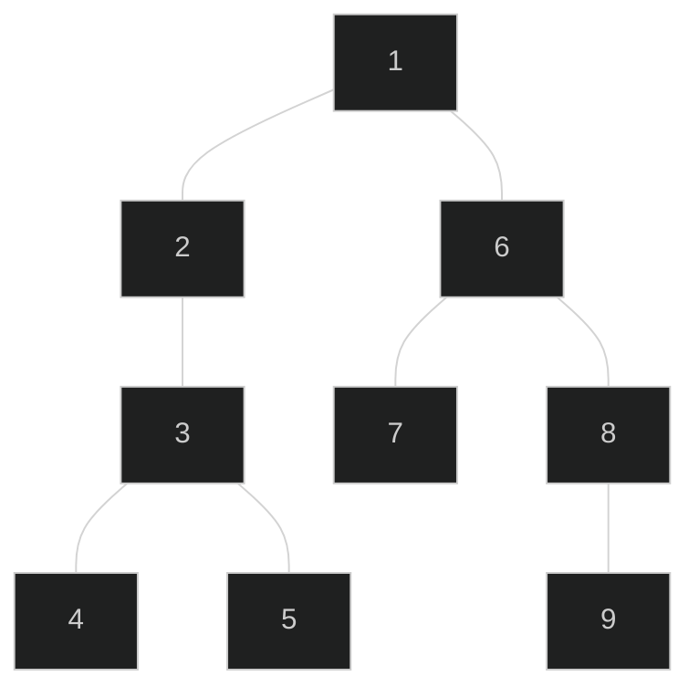
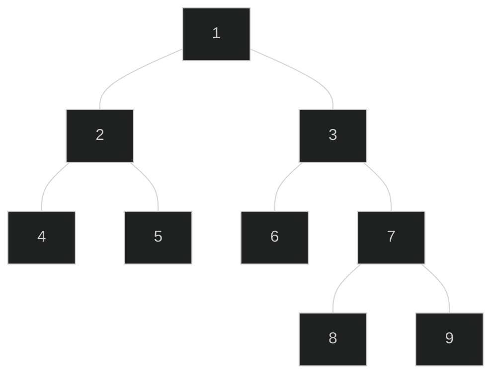
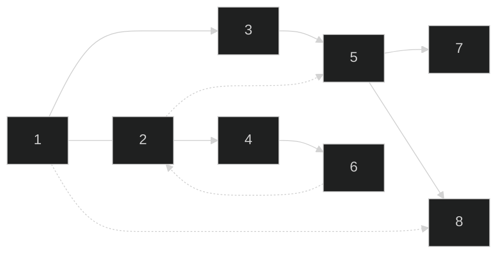

${toc}

# Graph Traversal Problems O(V+E)

## DFS and BFS
- depth first seach(numbers show when a node was traversed)

- breadth first search

- algorithms  
	
	```cpp
	//the true entries in visited array denotes a connected component 
	//so can be used for getting connected components
	vector<vector<int>> adj_list;
	int V = adj_list.size();
	void dfs(int u){
		static vector<int> visited(V, 0);
		visited[u] = 1;
		cout<<v<<"->";//final op
		for(auto x:adj_list[u])
			if(!visited[x]) dfs(x);
	}
	
	void bfs(int v){
		vector<int> visited(V,0);
		queue<int> q;
		q.push(v);
		visited[v] = 1;
		while(!q.empty()){
			int u = q.front(); q.pop();
			cout<<u<<"->";//final op
			for(auto x:adj_list[u])
				if(!visited[x])
					q.push(x), visited[x] = 1;
				
		}
	}
	```

## Flood Fill
```cpp
vector<vector<char>> grid = {
    {'#','#','#','#','#','#'},
    {'#','$','$','$','#','#'},
    {'#','#','$','#','#','#'},
    {'#','#','$','#','#','#'},
    {'#','#','$','$','#','#'},
    {'#','#','#','$','#','#'}
};
int C = 6, R = 6;
//fill c2 in blocks containing c1
//also counts number of filled pixels; dfs based
int floodfill(int r, int c, char c1, char c2){
    //directions
    static int drow[] = {0, 0,1,1, 1,-1,-1,-1};
    static int dcol[] = {1,-1,0,1,-1, 0, 1,-1};
    if(r<0 || r>=R || c<0 || c>=C) return 0;
    if(grid[r][c] != c1) return 0;

    int ans = 1;
    grid[r][c] = c2;
    for(int i=0;i<8;i++)
        ans += floodfill(r+drow[i], c+dcol[i], c1, c2);
    return ans;
}
```

## Topological Sort
- DAG(directed acyclic graph): directed graph that doesn't contain loops
- topological sort of DAG: vertices ordering such that for every edge `u->v`, `u` comes before `v` in the ordering

```cpp
vector<vector<int>> adj_list;
int V = adj_list.size();

stack<int> top_sort;
vector<int> visited(V, 0);
void dfs_util(int u){
    visited[u] = 1;
    for(auto x: adj_list[u]){
        if(!visited[x])
            dfs_util(x);
    }
    top_sort.push(u);
}
void topological_sort(){
    for(int i=0; i<V; i++)
        if(!visited[i]) 
            dfs_util(i);
    //final op
    while(!top_sort.empty()){
        cout<<top_sort.top()<<",";
        top_sort.pop();
    }
    cout<<'\n';
}
```

### Kahn's Algorithm
- topological sort BFS style
```cpp
vector<vector<int>> adj_list;
int V = adj_list.size();
void kahn_topological_sort(){
	vector<int> in_degree(V, 0);
	vector<int> result;
	for(auto x:adj_list)
		for(auto y:x)
			in_degree[y]++;

	queue<int> q;
	for(int i=0; i<V; i++)
		if(in_degree[i] == 0) q.push(i);

	while(!q.empty()){
		int u = q.front();q.pop();
		result.push_back(u);
		for(auto neighbor : adj_list[u]){
			in_degree[neighbor]--;
			if(in_degree[neighbor] == 0) q.push(neighbor);
		}
	}
	//final op
	for(auto x:result) cout<<x<<", ";
	cout<<'\n';
}
```

## Bipartite Graph Check
- bipartite graph: such graph that can be divided into two disjoint sets such that every edge will take us from one of the sets to other
- algorithm uses colors for those two sets
```cpp
vector<vector<int>> adj_list;
int V = adj_list.size();
bool bipartite_check(int v = 0){
	vector<int> color(V,-1);
	queue<int> q;q.push(v);
	color[v] = 0;

	while(!q.empty()){
		int u = q.front(); q.pop();
		for(auto x:adj_list[u]){
			if(color[x] == -1){
				q.push(x);
				color[x] = 1 - color[u];
			}
			else if(color[x] == color[u]) return false;      
		}
	}
	return true;
}
```

## Graph Edge Properties Check


- vetex annotation:
    - unvisited: not traversed
    - explore: traversed
    - visited: vertex fully DFSed
- in the above diagram
    - solid lines are tree edges
    - 1->8 is forward edge
    - 2->1 is bidirectional edge
    - 2->5 is cross edge
    - 6->2 is back edge
- one thing: the result depend on the ordering of  `adj_list`
	
	```cpp
	vector<vector<int>> adj_list;
	int V;
	const int UNVISITED = 0, EXPLORED = 1, VISITED = 2;
	vector<int> parent(V,0), state(V,UNVISITED);
	
	void dfs_util(int u){
		state[u] = EXPLORED;
		for(auto x: adj_list[u]){
			if(state[x] == UNVISITED){ //EXPLORED -> UNVISITED
				printf("\tTree Edge (%d,%d)\n",u,x);
				parent[x] = u;
				dfs_util(x);
			}else if(state[x] == EXPLORED){//EXPLORED -> EXPLORED
				if(x == parent[u]) printf("\tTwo Way Edge (%d,%d)\n",u,x);
				else printf("\tBack Edge (%d,%d)\n",u,x);
			}else if(state[x] == VISITED){//EXPLORED -> VISITED
				printf("\tForward/Cross Edge (%d,%d)\n",u,x);
			}
		}
		state[u] = VISITED;
	}
	
	void edge_property_check(){
		int nComponent = 1;
		for(int i=0; i<V; i++)
			if(state[i] == UNVISITED){
				printf("COMPONENT %d:\n",nComponent++);
				dfs_util(i);
			}
	}
	```

## Articulation vertices and edges
- articulation point: vertex, removing it disconnects the graph
- bridge: edge, removing it disconnects the graph
- algorithm
	- for undirected graph only
	- `dfs_num`: track the iteration counter when a vertex is visited for the first time
	- `dfs_low`: lowest `dfs_num` reachable from current DFS spanning subtree of the vertex
	  $dfs\_low[u]  = min \begin{cases} 
	  dfs\_num[u]\\ 
	  dfs\_num[p] & \text{for all }p\text{ where }(u,p)\text{ is a back edge}\\
	  dfs\_low[v] & \text{for all }v\text{ where }(u,v)\text{ is a tree edge}
	  \end{cases}$
	- there's a back edge from $u$ or its descendants to one of its ancestors if and only if:
		vertex $u$ has a child $v$ for which `dfs_low[v]<=dfs_num[u]`
		- the back edge comes back to $u$ if `dfs_low[v]==dfs_num[u]`
		- so an edge `(u,v)` is bridge if `dfs_low[v]>dfs_num[u]`
	- at first `dfs_low[u]	== dfs_num[u]` and `dfs_low[u]` become smaller when a cycle is encountered 
```cpp
vector<vector<int>> adj_list;
int V;
vector<int> tin, low;
int timer;
void dfs(int v, int p = -1) {
	tin[v] = low[v] = timer++;
	for (int to : adj_list[v]) {
		if (to == p) continue;
		if (tin[to] == -1) low[v] = min(low[v], tin[to]);
		else {
			dfs(to, v);
			low[v] = min(low[v], low[to]);
			if (low[to] > tin[v]) IS_BRIDGE(v, to);//main op
		}
	}
}
void find_bridges() {
	timer = 0;
	tin.assign(V, -1);
	low.assign(V, -1);
	for (int i = 0; i < V; ++i) {
		if (tin[i] == -1) dfs(i);
	}
}
```

## Kosaraju's Algorithm for Strongly Connected Components

```cpp
stack<int> stk;
vector<int> visited(V,0);
vector<vector<int>> adj_list_transpose(V);
void dfs_util(int u){
    visited[u] = 1;
    for(auto x:adj_list[u])
        if(!visited[x]) dfs_util(x);
    stk.push(u);
}
void dfs_util2(int u){
    visited[u] = 1;
    cout<<u<<", ";
    for(auto x:adj_list_transpose[u])
        if(!visited[x]) dfs_util2(x);
}
void kosaraju_algorithm(){
    for(int i=0; i<V; i++)
        if(!visited[i]) dfs_util(i);

    visited.assign(V,0);
    for(int i=0; i<V; i++)
        for(auto neighbor:adj_list[i])
            adj_list_transpose[neighbor].push_back(i);
    
    while(!stk.empty()){
        int v = stk.top(); stk.pop();
        if(!visited[v]){
            dfs_util2(v);
            cout<<'\n';
        }
    }
}
```