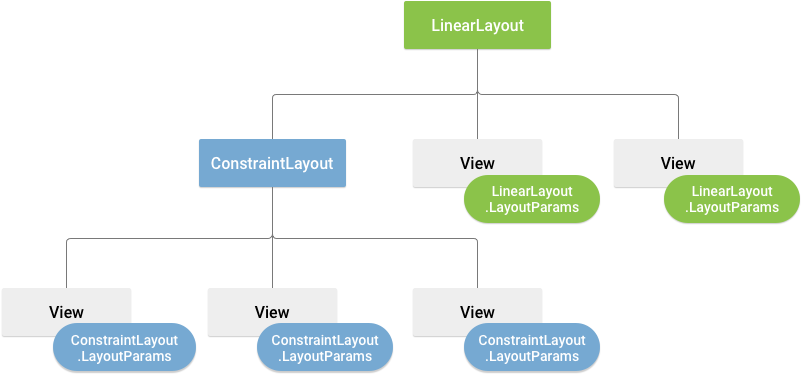

<script 
    type="text/javascript"
    src="https://unpkg.com/mermaid@8.13.2/dist/mermaid.min.js">
</script>

<link 
  rel="stylesheet" 
  href="https://cdn.jsdelivr.net/npm/katex@0.13.18/dist/katex.min.css" integrity="sha384-zTROYFVGOfTw7JV7KUu8udsvW2fx4lWOsCEDqhBreBwlHI4ioVRtmIvEThzJHGET" crossorigin="anonymous">

<script defer 
  src="https://cdn.jsdelivr.net/npm/katex@0.13.18/dist/katex.min.js" integrity="sha384-GxNFqL3r9uRJQhR+47eDxuPoNE7yLftQM8LcxzgS4HT73tp970WS/wV5p8UzCOmb" crossorigin="anonymous">
</script>

<script defer 
  src="https://cdn.jsdelivr.net/npm/katex@0.13.18/dist/contrib/auto-render.min.js" integrity="sha384-vZTG03m+2yp6N6BNi5iM4rW4oIwk5DfcNdFfxkk9ZWpDriOkXX8voJBFrAO7MpVl" crossorigin="anonymous">
</script>
<script>
    document.addEventListener("DOMContentLoaded", function() {
        renderMathInElement(document.body, {
          // customised options
          // • auto-render specific keys, e.g.:
          delimiters: [
              {left: '$$', right: '$$', display: true},
              {left: '$', right: '$', display: false}
          ],
          // • rendering keys, e.g.:
          throwOnError : false
        });
    });
</script>
- [Android User Interface](#android-user-interface)
- [Data Binding](#data-binding)
    - [First Step](#first-step)
    - [in XML](#in-xml)
    - [in Kotlin activity file](#in-kotlin-activity-file)
    - [Binding Data](#binding-data)
- [Adapter Views](#adapter-views)
- [Dialogs](#dialogs)

# Android User Interface

<div class="mermaid">%%{init: {'theme': 'base', 'themeVariables': { 'primaryColor': '#aaffff', 'background': '#000000'}}}%%
graph TD;
    ViewGroup --> View1;
    ViewGroup --> View2;
    ViewGroup --> ViewGroup2;
    ViewGroup2 --> View3;
    ViewGroup2 --> View4;
    ViewGroup2 --> View5;


</div>
- `ViewGroup` is just an invisible container, usually called layout
- `View`s are called widgets
- these can be declared in XML file or at the runtime programmatically(Layout Inspector for debugging layout)
- XML file must contain one and only one root element
- XML layout file in compiled into a `View` source. Do this to access it in the code:
```kotlin
fun onCreate(savedInstanceState: Bundle) {
	super.onCreate(savedInstanceState)
	setContentView(R.layout.main_layout)//R for resource
}
```
    
- The id of a View object is defined as string in XML file but stored as integer
```xml
<--in XML file defining id-->
android:id="@+id/my_button"
```
```kotlin
//in kotlin file to access the View object
val myButton: Button = findViewById(R.id.my_button)
```
- An ID need not be unique throughout the entire tree, but it should be unique within the part of the tree you are searching (which may often be the entire tree, so it's best to be completely unique when possible).    
- the `binding` feature can replace `findViewById()` calls
    
- Every ViewGroup class implements a nested class that extends `ViewGroup.LayoutParams`. This subclass contains property types that define the size and position for each child view, as appropriate for the view group.
    
    
- every LayoutParams subclass has its own syntax for setting values so child must define LayoutParams appropriate for its parents
    
- All view groups include a `layout_width` and `layout_height`, and each view is required to define them
- density-independent pixel units (dp), wrap\_content, or match\_parent, are better approach for defining these because it helps ensure that your app will display properly across many screen size  
- sp(scale-independent pixel) is for fonts and for anything else use dp
- The density- independent pixel is equivalent to one physical pixel on a 160 dpi screen
    

# Data Binding

## First Step
- modify module gradle file and sync
```
android {
    ...
    buildFeatures {
        dataBinding true
    }
}
```
## in XML
```xml
<?xml version="1.0" encoding="utf-8"?>
<layout xmlns:namespace="nsURI">
    <data>
        
    </data>
    <!--The root view element-->
    <LinearLayout>
        ...
    </LinearLayout>
</layout>
```
## in Kotlin activity file

```kotlin
class MainActivity : AppCompatActivity() {
    //activity layout activity_main.xml so type is ActivityMainBinding
    private lateinit var binding: ActivityMainBinding
    override fun onCreate(savedInstanceState: Bundle?) {
        super.onCreate(savedInstanceState)
        binding = DataBindingUtil.setContentView(this, R.layout.activity_main)
        binding.runButton.setOnClickListener........
    }
}
```
## Binding Data
- create a data class(it doesn't have to be  a data class always)
```kotlin
data class User(val firstName:String, val lastNameL:String)
```
- in activity's XML layout's `data` tag

```xml
<data>
	<!--Data goes here; name for reference; type for class type-->
	<variable name="user" type="com.example.trivia.User"/>
<data/>
```
- using variable in activity file
```kotlin
binding.user = User("Rahul", "Gill")
```
- using variable in layout file
```xml
<TextView android:text="@{user.firstName}" />
<!--or-->
<TextView android:text="@={user.firstName}" />
```

# Dialogs, Toasts & Snackbars
```kotlin
Toast.makeText(activity, "Toast made",Toats.LENGTH_LONG).show()
```
```kotlin
val dialog = AlertDialog.Builder(this.activity)
            .setTitle("Show AAA or BBB")
            .setIcon(R.drawable.icon_for_dialog)
            .setMessage("this dialog is just for showing off")
            .setPositiveButton("AAA"){ _, _ ->
                Toast.makeText(this.activity, "aaaaaaaaaa!", Toast.LENGTH_LONG).show()
            }.setNegativeButton("BBB"){ _, _ ->
                Toast.makeText(this.activity, "bbbbbbbbb!", Toast.LENGTH_LONG).show()
            }.create()
        binding.dialogButton1.setOnClickListener{ dialog.show() }
```
```kotlin
Snackbar.make(binding.coordLayout, "woah",Snackbar.LENGTH_LONG).also{ snackbar ->
              snackbar.setAction("OK"){
                  snackbar.dismiss()
              }
        }.show()
```

# Logging
- log types: verbose(all), debug, info, warn, error, assert
- Logging library Timber setup:
	- add the dependecies to gradle module build file
	- create an application class and add this to its onCreate method
	```
	Timber.plant(Timber.debugTree())
	```
	- in the manifest file setup the application name property
	```
	<application android:name=".ApplicationClassName">
	```
- to log with the  library
```
Timber.i("message to log")
```