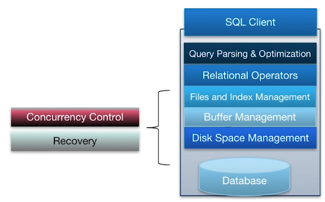
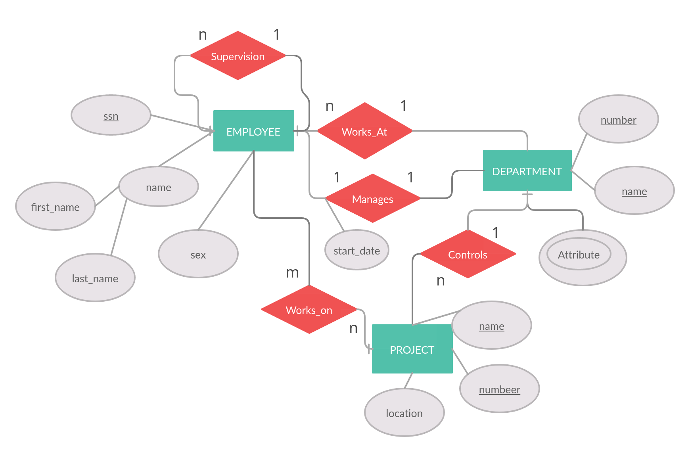
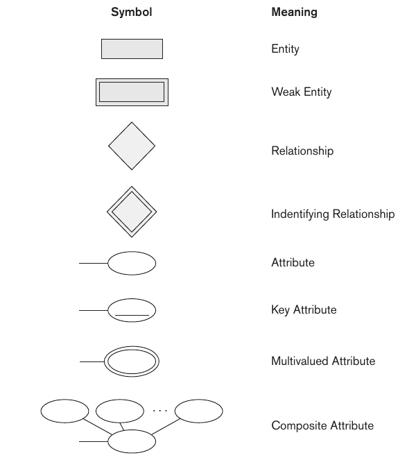
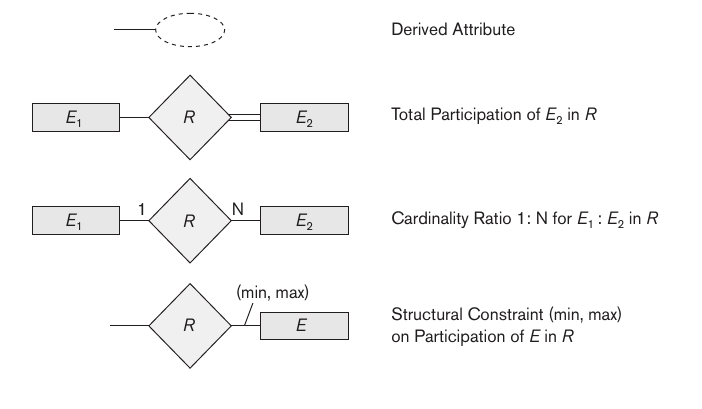
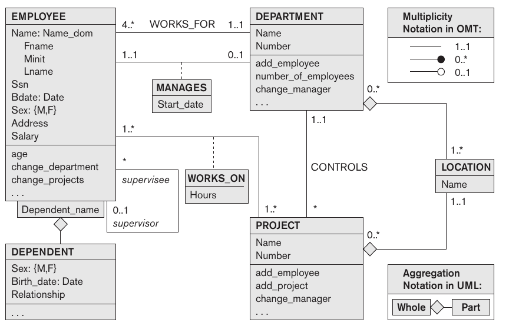
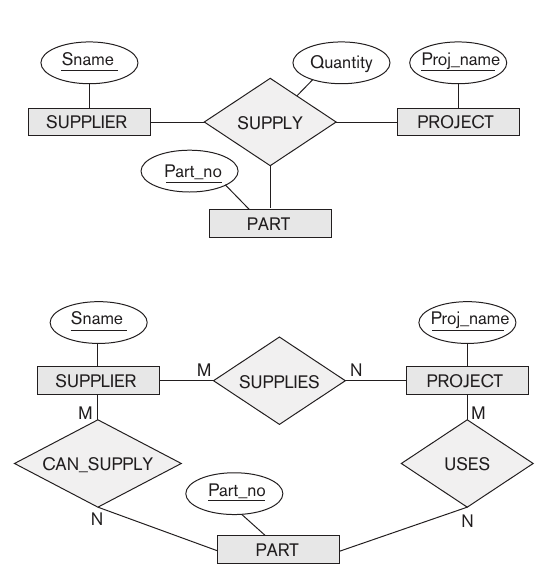
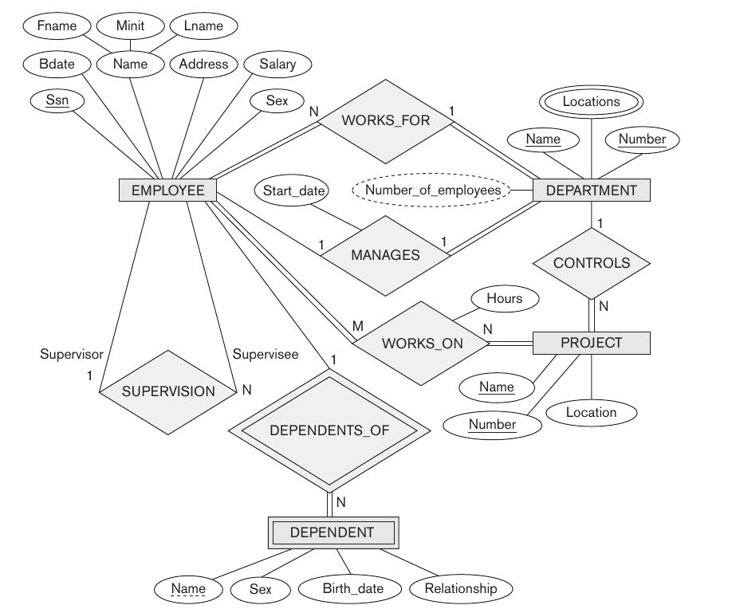
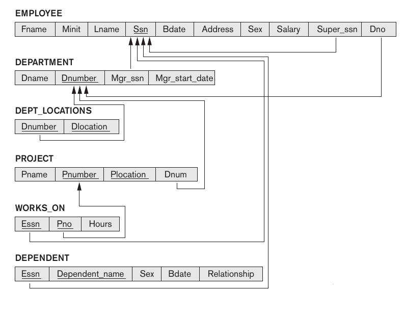

<link 
  rel="stylesheet" 
  href="https://cdn.jsdelivr.net/npm/katex@0.13.18/dist/katex.min.css" integrity="sha384-zTROYFVGOfTw7JV7KUu8udsvW2fx4lWOsCEDqhBreBwlHI4ioVRtmIvEThzJHGET" crossorigin="anonymous">

${toc}
# Introduction

- **Database**: collection of related data that models some aspect of the real world.
    
- **DBMS**: general purpose software to define, create, maintain, process and manipulate databases.
    
- **DBMS over file-system**:
    
    - multi user access(atomic updates and concurrent access)
    - data consistancy(if same data at different places match do or do not match)
    - data integrity(constrains on data manipulation like specifying data types, uniqueness etc.)
    - isolation(one transaction doesn't know about and affect other transactions)
    - backup and recovery
    - better security
    - reduces redundancy(same data stored multiple times)
    - efficient and easier data access
- **Data Models**: describes entire structure of database
    most also include set of operations for retrievals and updates on the database. Some also specifying behaviour(like COMPUTE_GPA on STUDENTs)
    
    - conceptual data models(object based data models) like entity relationship model
    - representational(implementation or record based model) model like relational model
    - physical data model: how data actually stored physically
- self decribing models like xml and nosql key-value store
    
- **Database Schema**: description of database
    
- schema is fixed: not changed very often
    
- objects in schema called schema constructs
    
- **Database Instance**: the data itself
    
- **database state or snapshot**: data in database at a particular moment
    
- schema doesn't contains constrains etc. These extra info stored as **meta data**
    
- schema, metadata are stored in **database catalog**
    
- changing schema: **database evolution**
    

# Three Schema Architecture

- schemas defined at three levels
    - internal level schema: physical storage structure of database
    - conceptual level schema; describes entities, data types, relationships, user operations and constrains.
    - external/view level: a number of external schemas/user views: describe part of database that a user group is interested in.

%%{init: {'theme': 'base', 'themeVariables': { 'primaryColor': '#ffff33', 'background': '#ff0000','titleColor':'#ffffff','nodeBorder':'#000000'}}}%%
flowchart TD;
    subgraph ViewLevel
        a([View1])
        b([View2])
        c([View3])
    end
    a <--> d([Logical Level]) <--> e([Internal Level])
    b <--> d
    c <--> d
    e --- db2[(database)]
    e --- db1[(database)]
    e --- db3[(database)]

- Most DBMSs do not separate the three levels completely and explicitly, but they support the three-schema architecture to some extent
- these are just schemas, data is stored physically
- this can provide data independence like if we want to change physical structure of data, we can just modify the internal level schema. the upper levels can be same as before.
	- logical data independence: maintain views when logical strucutre changes
	- physical data dependence: maintain logical structure when physical structure is changed
	- important because $dapp/dt << denv/dt$
- we'll need mapping for different levels(e.g. how we get views from logical structure)

# DBMS launguages

- **DDL**(Data definition language)
    
- in most DBMSs **DDL** handles both internal and view level schemas and internal schema is specified by some parameters.
    
- **DML** data manupulation language
    
- **DCL** data control language(access management)
    
- **TCL** transaction management language
    
- **SQL**(sequel query language) does role of all of these
    

# DBMS Architecture

## Two and Three Tier Architecture

- **two tier**: the application logic is either buried inside the User Interface on the client or within the database on the server (or both)
- **three tier**: the app logic lives in the middle tier, seperated from data and user interface. More scalable, robust and flexible

%%{init: {'theme': 'base', 'themeVariables': { 'primaryColor': '#ffff33', 'background': '#ff0000','titleColor':'#ffffff','nodeBorder':'#000000'}}}%%
flowchart TD;
    a([Prensentation Layer]) <--> b([Business Logic]) <--> c([DBMS sevice])

- two-tier less secure as client communicate with database directly

# ER(Entity-relationship) Model

- **entity**: represents real world object
- **relationships** of entities: like EMPLOYEE works-on PROJECT

### Attributes

- **attributes**: properties of entity objects
- simple(atomic like `int`,`char`): can't be divided further
- composite(like `name`--\> `firstname`, `lastname`): composed of simple attributes
- multivalued(like `past_work_experiences`): can take multiple values for a single given entity
- stored/derived(like `age` can be derived from `birth_date`)
- key-attributes: can indentify an entity uniquely
- nulls: to represent non-applicable or unknown value
    /////////////////
- value set of attributes: range of values which the attribute can take value from

### Entity sets

- entity type defines a collection (or set) of entities that have the same attributes and that set is called **entity set/entity collection**
- entity type descible schema or **intention** and entity set is also called **extension**
- **Strong Entity Set**:
    - A strong entity set is an entity set that contains sufficient attributes to uniquely identify all its entities.
    - In other words, a primary key exists for a strong entity set.
    - Primary key of a strong entity set is represented by underlining it.
- **Weak Entity Set**:
    - A weak entity set is an entity set that does not contain sufficient attributes to uniquely identify its entities.
    - In other words, a primary key does not exist for a weak entity set.
    - these are identified by being related to other strong entity types called identifying/owner entity types
    - have existence dependency on owner entity type
    - However, it contains a partial key called a discriminator.
    - Discriminator can identify a group of entities from the entity set and can identify an entity with the owner entity
    - Discriminator is represented by underlining with a dashed line.

### Relationship sets

- relationship type defines a set of associations amont n entities called relationship set
- **degree of relationship**: number of participating entity types
    - Unary Relationship Set - Unary relationship set is a relationship set where only one entity set participates in a relationship set. recursive/self-referencing relationship
    - Binary Relationship Set - Binary relationship set is a relationship set where two entity sets participate in a relationship set.
    - Ternary Relationship Set - Ternary relationship set is a relationship set where three entity sets participate in a relationship set.
    - N-ary Relationship Set - N-ary relationship set is a relationship set where ‘n’ entity sets participate in a relationship set.
- role name: signifies role of participating entity in the relationship
- **cardinality constraint** on binary relationship
    - one-to-one cardinality(A & B can have atmost one relation)
    - one-to-many cardinality(A can relate to muliple Bs but B can only relate to one A)
    - many-to-one cardinality(B can relate to muliple As but A can only relate to one B)
    - many-to-many cardinality(A can relate to muliple Bs and B can relate to muliple As)
- **participation/minimum cardinality constraint** for an entity to exist, it must have a minimum number of relationships with other specified entities like every employee must work in some department: existence dependency
- attributes of relationships: for example the `start_date` on which an `EMPLOYEE` started managing a `DEPARTMENT`
- attributes of 1:1 relationships can be moved to one of the participating entity type
- 1:1 relationships attributed can only be moved to N side

### E-R diagrams

### Unified Modeling language(UML)

### Relationships with degree >2

# Relational Model

- uses concept of mathmatical relation. It has theoretical basis in set theory and first-order predicate logic.
- database is represented as collection of relations(ressembles a table or flat file record; flat file mean each record has simple linear/flat structure)
- relational because ressembles to maths' relation(rows as tuples and table as collection of tuple)
- terminlogy
    - **Databases**: set of named relations
    - **Relation or Tables:** have two parts
        - **Schema** description or metadata
        - **Instance** set of data satisfying the schema
    - **Attribute**:column or field; have its schema and instance
    - **Tuple or row or record**
    - **domain** possible values an attribute can take; set of atomic values
- **Relation Schema/Scheme** $R(A_1, A_2, ..., A_n)$, $R$: relation name, $A_i$s: attributes
- degree/arity of relation: number of attributes
- a relation r of relation shchema $R(A_1, A_2, ..., A_n)$ is set of n-tuples: $r =r(R)= \{t_1,t_2,t_3,...,t_m\}\text{ where } t = \langle v_1,v_2,...,v_n\rangle$; $v_i$ is element of domain of $A_i$
    r$\subseteq (dom(A_1) \times dom(A_2) \times ... \times dom(A_n))$
- logically, ordering of attributes is unneccessary
- in this model, compostite attributes are represeneted only by their simple attributes
## Keys
- keys help to uniquely identify records in a relation
- **super keys**: super keys can have redundant attributes(dropping some attributes can still unquely identify the record)
- **candidate keys**: minmal subsets of super keys(we won't be able to identify record after dropping even a single attribute)
- **primary keys**: the candidate key, which is used to actually identify records
- **alternate keys**: candidate keys other than primary key
- **foreign keys**: keys, which are used to identify records of some another table(define relationship with another table)
- **composite key**: keys, composed of multiple attributes
- **compound key**: composite key containing foreign key
- **Unique Key**: It is unique for all the records of the table. Once assigned, its value cannot be changed i.e. it is non-updatable. It may have a NULL value.(for example some voter id which is unique, can't be changed and can be NULL is not assigned because age<18, but database can use some other key for example adhar id as primary key)
- **surrogate key**: key generated to uniquely identify records(when records can't be identified unqiuely with their own attributes)

## Contraints
- **domain constraint**: domain or set of values, an attriibute can take
- **key constraint**: keys must be unique and non-null
- **tuple unqueneess contraint**
- **entity integrity contraint**: primary key can't have null values
- **referencial integrity contraint**: 
- other contraint semantic integrity contraint like max bonus per week etc. are specified and enforced within apps
- these are static contraint(related to state of relations), others like some value can always decrease: dynamic constraints

# E-R to relational mapping
- **step 1**: for regular strong entities, create relations with only simple components of composite attributes; chose some key/keys as primary key
- **step 2**: weak entities mappped relations have foreign keys pointing to the owner entity. the foreign key and partial key form the primary key for this relation 
- **step 3**: binary relationships:
	- 1:1 and 1:N relationships can be transformed into foreign keys
	- in 1:1 case, the foreign key can be put in any of the two relation(preferably the entity with total participation in the relationship: like in DEPARTMENT for DEPARTMENT managed_by EMPLOYEE relationship)
	- in 1:N case the foreign key is added in the relation on N side
	- for M:N relationships, the only option is to create a new relation containing primary keys of participating relations and these two foreign key makes the primary key of the new relation(called relationship relation or lookup table). This approach can also be used for 1:1 or 1:N relationship type(when few relationships exist between two relation types)
- **step 4**: multi-valued attributes: create a new relation containing the primary key as foreign key R of table that containing this multi-valued attribute, and the value A of attribute. R and A makes the primary key for this relation
- **step 5**: n-ary relationships: create a new relationship relation with primary keys of participating relations as foreign keys and include attribtes of the relationship as simple attributes. Combination of foreign keys makes up the primary key
- example

is mapped to 

- summary

|ER Model| Relational Model|
|---|---|
|Entity type|Relation|
|1:1 or 1:N binary relationship|Foreign key(or relationship relation)|
|M:N binary relationship|relationship relation with 2 foreign keys|
|n-ary relationship|relationship relation with n foreign keys|
|simple attribute|attribute|
|composite attribute|set of simple attributes|
|multi-valued attribute|relation with foreign key to containing relation|
