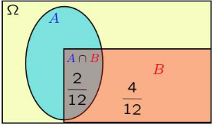
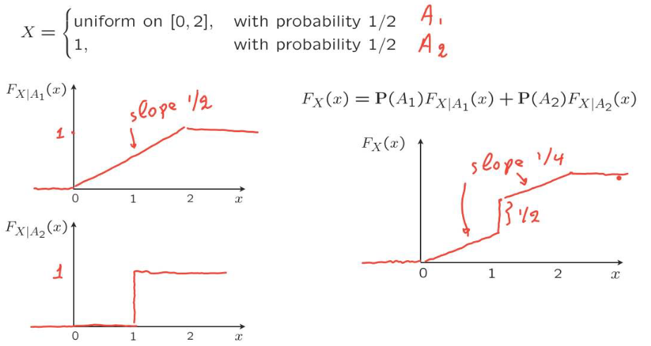

<link 
  rel="stylesheet" 
  href="https://cdn.jsdelivr.net/npm/katex@0.13.18/dist/katex.min.css" integrity="sha384-zTROYFVGOfTw7JV7KUu8udsvW2fx4lWOsCEDqhBreBwlHI4ioVRtmIvEThzJHGET" crossorigin="anonymous">

${toc}

# Basics
- function that measures the probability of a particular outcome(or set of outcomes) is called probability distribution
- sample spacce $\Omega$: set of all possible outcomes with properties
	- mutually exclusive
	- collectively exhaustive
	- at the right granularity
- event: subset of sample space(probability is assigned to events)
- Event Space $\mathcal{A}$: potential results of experiment; set of all events; subset of powerset of $\Omega$
- probability axioms
	- $P(A)\geq 0$ non-negativity
	- $P(\Omega )=1$ normalization
	- (finite)additivity if $A \cap B=\phi$ then $P(A\cup B)=P(A) + P(B)$: this only hold for countable sequence of events(whose elements can be arranged in a sequence: 1/2,1/4,1/8... is countable sequence but real line is not)

#  Conditioning & Baye's Theorem
- $P(A | B)$: probability of A given B(happened)
$$P(A | B)=\frac{P{(A \cap B)}}{P(B)}
$$

- multiplication rule $P(A\cap B)=P(B)P(A|B)=P(A)P(B|A)$
- total probability theorem: if sample space partitioned into $A_1,A_2,...$ then 
  $$P(B)=\sum\limits_{i}{P(A_i)P(B|A_i)}
  $$
  
 

- **Baye's rule**
	- have $P(A_i)$'s (initial belief of situations e.g. probability of faulty equipment)
	- have $P(B|A_i)$'s' (e.g. probability of operation failure given faulty/non-faulty equipment)
	- revise beliefs, given that B occured
$$
P(A_i|B) = \frac{P(A_i\cap B)}{P(B)}= \frac{P(A_i)P(B|A_i)}{ \sum\limits_{j}{P(A_j)P(B|A_j)} }
$$

 

- Bayesian inference
	- initial beliefs $P(A_i)$ on the possible cause of an observed even B
	- model the world under each $A_i$ i.e. $P(B|A_i)$ so  
		$A_i \xrightarrow [ P(B|A_i) ] {\text{model}}B$ 
	- draw conclusions about causes 
		$B \xrightarrow [ P(A_i|B) ] {\text{inference}}A_i$
		
		
# Independence of events
- $P(B|A)=P(B)$; or $P(A|B)=P(A)$; or $P(A\cap B)=P(A)P(B)$
- information on some events doest not change probabilities of other events
- independence vs pairwise independence

# Counting
- basic counting principle: $r$ stages with $n_i$ choices at state $i$ the number of choices are $n_1\cdot n_2\cdot n_3\cdot ...\cdot n_r$
- permutations: number of ways of ordering the n items $n!$
- number of  ordered sequence of k elements from an n-element set is $\frac{n!}{(n-k)!}$
- combinations $\binom{n}{k}$: number of k element subsets of n-element set
$$\binom{n}{k} = \frac{n!}{k!(n-k)!}
$$
- $$\sum\limits_{k=0}^n{\binom{n}{k}} = \#subsets = 2^n
$$
-  $\binom{n}{k}$ are also called binomial coefficients
- in n coin tosses $P(k\ heads) = \binom{n}{k}p^k(1-p)^{n-k}$

 

- n distinct items; r persons; $i^{th}$ person given $n_i$ items then number of partitions(multinomial coefficient)
$$ \#partitions = \frac{n!}{n_1!\cdot n_2!\cdot ...\cdot n_r!}
$$
- multinomial probability: i items; $p_i$ probability of chosing $i^{th}$ item; trial of chosing items done n times then 
$$P(a\ permuattion\ of\ type\ (n_1,n_2,...,n_r)) = p_1^{n_1}\cdot p_2^{n_2}\cdot ... p_r^{n_r}\\
P(n_1\ item\ 1,n_2\ item\ 2,...,n_r\ item\ r) = \frac{n!}{n_1!\cdot n_2!\cdot ...\cdot n_r!}\cdot p_1^{n_1}\cdot p_2^{n_2}\cdot ... p_r^{n_r}
$$

# Random variables
- we refer to probabilities on quantities of interest denoted by $\mathcal{T}$(target space) and elements are referred as states. A mapping function $X:\Omega \to \mathcal{T}$ is called random variable(but its not random & its not variable)
$$
P_X(S)=P(X\in S)=P(X^{-1}(S))=PoX^{-1}(S)= \\
P(\{ \omega \in \Omega : X(\omega) \in S \})
$$

# Discrete Random variables
- Probability mass function(pmf) of discrete random variable X: probability distribution/law of X
$$p_X(x)=P(X=x)=P({\omega \in \Omega: X(\omega)=x})
$$
- Bernoulli random variable(success/failure model)
$$X = \begin{cases}
1, & \text{with probability p}\\    
0, & \text{with probability 1-p}
\end{cases}
$$
- Discrete uniform random variable
	- parameters a,b; $a\leq b$
	- experiment: pick one of $a,a+1,...,b$ all equal likely
- Binomial random variable
	- experiment: n independent tosses of a coin with $P(Heads) = p$
	- models number of successes in n trials with $P(success)=p$
	- parameters: positive integer n, p in $[0,1]$ 
$$
p_X(k) = \binom{n}{k}p^k(1-p)^{n-k};\quad k=0,1,2,...,n
$$
- Geometric random variable
	- experiment: infinitely many independent tosses of a coin with $P(Heads) = p$
	- X: number of tosses until first heads
	- models: number of tries until success
$$p_X(k)=P(\text{tails k-1 times then heads})=(1-p)^{k-1}p;\quad k=1,2,3,...
$$

# Expectation & Variance
$$\mu = E[X]=\sum\limits_{x}{x\cdot p_X(x)}
$$
- represent mean value of X
- expectation of bernoulli: $E[X]=p$; 
   if it denotes success of event A then $E[X]=P(A)$
- expectatition of uniform on $0,1,2,...,n\quad E[X]= \frac{1}{n+1}\cdot (0+1+...+n)=n/2$; 
  n students & weight of $i^{th}$ is $x_i$, one of them choses randomly & all equally likely then average weight of them $E[X]=\frac{1}{n}\cdot \sum\limits_{i}{x_i}$
	  
 

- $$E[g(X)]=\sum\limits_{x}{g(x)\cdot p_X(x)}
$$
- linearty $E[aX+b]=aE[X]+b$

 

- variance: measure the spread of X
$$var(X)=E[(X-\mu )^2]=\sum \limits_{x}{(X-\mu )^2\cdot p_X(x)}
$$
- standard deviation $\sigma_X = \sqrt{var(X)}$
- $$var(aX+b)=a^2\cdot var(X)
$$
- $$var(X)=E[X^2]-(E[X])^2
$$
- variance of bernoulli is $p(1-p)$
- variance of uniform $= \frac{1}{n+1}(0^2+1^2+...+n^2)-\frac{n}{2} = \frac{1}{12}n(n+2)$
   n can be replaced by b-a, if 0,1,2,...,n are replaced by a,a+1,...,b
   
# Conditioning discrete random variables
- $$p_{X|A}(x) = P(X = x\ |\ A)\\
$$
- $$E[X|A] = \sum\limits_{x}{xp_{X|A}(x)}
$$
- $$E[g(X)|A] = \sum\limits_{x}{g(x)p_{X|A}(x)}
$$
- total expectation theorem 
$$E[X]=\sum\limits_{i}{P(A_i)E[X|A_i]}
  $$
  
  
 
 - conditioning geometric random variable:
   similarly if conditioned on X>n, then X-n is geometric with parameter p
- memorylessness: conditioning this way result in geometic random variable with parameter p, so
$$p_{X-n|X>n}(k) = p(T_{n+1}T_{n+2}...T_{k}H_{k+1} | T_1T_2...T_n) = \\
p(T_{n+1}T_{n+2}...T_{k}H_{k+1})=p(k)\\
\implies p_{X-n|X>n}(k) =p(k)
$$
- mean of geometric variable
$$
E[X] = 1 + E[X-1]\\
\implies E[X] = 1 + pE(X-1 | X=1) + (1-p)E(X-1|X>1)\\
\implies E[X] = 1 + 0 + (1-p)E[X]\\
\implies E[X] = 1/p
$$

# Multi-random-variables & joint pmf
$$p_{X,Y}(x,y)= P(X = x\ \text{and}\ Y=y)\\
p_X(x) = \sum\limits_{y}{p_{X,Y}(x,y)}\\
p_Y(y) = \sum\limits_{x}{p_{X,Y}(x,y)}\\
 \sum\limits_{x} \sum\limits_{y}{p_{X,Y}(x,y)}=1
$$
- for three
$$
 \sum\limits_{x} \sum\limits_{y} \sum\limits_{z}{p_{X,Y,Z}(x,y,z)}=1\\
 p_X(x) = \sum\limits_{y} \sum\limits_{z}{p_{X,Y,Z}(x,y,z)}\\
  p_{X,Y}(x,y) = \sum\limits_{z}{p_{X,Y,Z}(x,y,z)}
$$
 

- functions of multiple random variables
$$Z =g(X,Y)\\
p_Z(z) = P(Z=z)=P(g(X,Y)=z)=\sum\limits_{(x,y):g(x,y)=z}{p_{X,Y}(x,y)}\\
E[g(X,Y)] =\sum\limits_{x}\sum\limits_{y}{g(x,y)\cdot p_{X,Y}(x,y)}
$$
- linearty of expectations can be proved with it
- with this, we can simply things using indicator variables as in next point
- mean of binomial:
  $X_{i}=1$ if trial i, a success(prob. p), $X_i=0$ otherwise(prob. 1-p)
$$
X =X_1 + X_2 + ... + X_n\\
\implies E[X] = E[X_1] + E[X_2 ]+ ... + E[X_n]\\
\implies E[X] = np
$$

# Conditining pmf with another random variable
$$p_{X|Y} = \frac{ p_{X,Y}(x,y) }{ p_Y(y) } \quad \text{defined for y: }\quad p_Y(y)\gt 0\\
p_{X,Y}(x,y) = p_Y(y)p_{X|Y}(x|y)\\
p_{X,Y}(x,y) = p_X(x)p_{Y|X}(y|x)
$$
- conditioning with more that one r.v.
$$p_{X|Y,Z} = \frac{ p_{X,Y,Z}(x,y,z) }{ p_{Y,Z}(y,z) }\\
p_{X,Y|Z} = \frac{ p_{X,Y,Z}(x,y,z) }{ p_{Z}(z) }\\
\quad \\
p_{X,Y,Z}(x,y,z) = p_X(x)\cdot p_{Y|X}(y|x)\cdot p_{Z|X,Y}(z|x,y)
$$
- more things
$$E[X|Y] = \sum\limits_{x}xp_{X|Y}(x|y)\\
E[g(X)|Y] = \sum\limits_{x}g(x)p_{X|Y}(x|y)	\\
E[X] = \sum\limits_{y}p_Y(y)E[X|Y=y] \quad \text{when sample space partitioned by Y}
$$
- independece of two r.v.s
$$
\quad  P(X=x\ and\ Y=y) = P(X=x)P(Y=y),\\
p_{X|Y}(x)=p_X(x) \quad \forall x,y\\
E[XY]= E[X]E[Y]\\
E[g(X)h(Y)]= E[g(X)]E[h(Y)]
$$
- for variance
$$
var(aX) = a^2var(X),\quad var(X+a) = var(X)\quad \text{always true}\\
var(X+Y) \neq var(X) + var(Y) \quad \text{in general}\\
var(X+Y) = var(X) + var(Y) \quad \text{if X and Y are independent}\\
$$

 

- variance of binomial
$$var(X) = var(X_1) + var(X_2) + ... +  var(X_n)\\
= nvar(X_1)
= np(1-p)
$$

# Continuous random variables & pdf
- probability density function pdf
$$P(a\leq X \leq b) = \int_{a}^{b}{f_X(x)dx}\\
f_X(x)\geq 0,\quad \int_{-\infty}^{\infty}{f_X(x)dx}=1	
$$
- a random variable is continuous, if it can be defined with a pdf
$$
E[X] = \int_{-\infty}^{\infty}{xf_X(x)dx}\\
var(X)= \int_{-\infty}^{\infty}{(x-\mu)^2f_X(x)dx}
$$
- continuous uniform random variable with parameters a,b
$$
f_X(x) = \frac{1}{b-a},\quad \text{when}\quad a\leq x\leq b\\
E[X] = \frac{a+b}{2}\\
var(X) = \frac{(b-a)^2}{12}
$$
- exponential random variable
$$f_X(x) = \begin{cases}
\lambda e^{-\lambda x}, & x\geq 0\\    
0, & x\lt 0
\end{cases}\\
E[X] = 1/\lambda\\
var(X) = 1/\lambda^2\\
P(X\geq a) = \int_{a}^{\infty} \lambda e^{-\lambda x}dx = e^{-\lambda a}
$$
 t

- cumulative distribution function cdf
$$F_X(x) = P(X\leq x) =  \int_{-\infty}^{x} f_X(t)dt\\
\frac{dF_X(x)}{dx} = f_X(x	)\\
\text{for discrete r.v.}\quad F_X(x) = P(X\leq x) =  \sum\limits_{k\leq x} p_X(k)
$$

# Normal(Gaussian) random variable
- standard normal
$$N(0,1): f_X(x) = \frac{1}{\sqrt{2\pi}}\cdot e^{-x^2/2}\\
E[X] = 0\\
var(X) = 1
$$
- general normal
$$N(\mu,\sigma^2): f_X(x) = \frac{1}{\sigma\sqrt{2\pi}}\cdot e^{-(x-\mu)^2/2\sigma^2}\\
E[X] = \mu\\
var(X) = \sigma^2
$$
- 
$$
Y = aX+B,\quad X\sim N(\mu,\sigma^2)\\
\text{then}\  Y\sim N(a\mu + b,a^2\sigma^2)\\
$$
- normalization of X: $Y = \frac{X-\mu}{\sigma}$

# Conditioning continuous r.v.s
- conditional pdf given an event
$$f_{X|A}(x)\cdot \delta \approx P(x\leq X \leq x + \delta\ |\ A)\\
P(X\in B \ |\ A) = \int_{B}{f_{X|A}(x)dx}
$$
- conditional pdf given $X\in A$
$$f_{X|X\in A}(x)\cdot \delta \approx P(x\leq X \leq x + \delta\ |\ X\in A)\\
\text{if x is in the interval A then }\\
f_{X|X\in A}(x)\cdot \delta =  \frac{P(x\leq X \leq x + \delta\ )}{ P(A) } = \frac{f_X(x)}{P(A)}\\
\ \\
\text{so } f_{X|X\in A}(x)\cdot \delta = \begin{cases}
	0, & \text{if } x\notin A\\    
	\frac{f_X(x)}{P(A)}, &  \text{if } x\in A
	\end{cases}\\
$$
 

- exponential pdf is memoryless: let $T$ be exponential pdf representing lifetime of something
$$P(T\gt x) = e^{-\lambda x} \text{ for } x\geq 0\\
\text{if we are told that } T\gt t,\\
\text{ then r.v. } X = \text{ remaining lifetime } = T - t\\
P(X\gt x\ |\ T\gt t) = e^{-\lambda x}
$$
 

- similar expressions for conditional expecation of r.v., of function of r.v., of total probability &  expectation theorem

# Mixed distribution
$$ X = \begin{cases}
	\text{discrete }Y, & \text{probability } p\\    
	\text{continuous }Z, &  \text{probability } 1-p
	\end{cases}\\
F_X(x) = p\cdot P(Y\leq x) + (1-p)\cdot P(Z\leq x)\\
 = pF_Y(x) + (1-p)P_Z(x)\\
\ \\
E_X[x] =  pE_Y[x] + (1-p)E_Z[x]
$$

# Joint continuous r.v.s
- two random variables are jointly continuous if they can be described by a joint pmf
$$f_{X,Y}: \text{probability per unit area}\\
P((X,Y)\in B) = \mathop{\int\int}\limits_{(x,y)\in B}f_{X,Y}(x,y)dxdy\\
\int_{-\infty}^{\infty}\int_{-\infty}^{\infty}{ f_{X,Y}(x,y)dxdy } = 1\\
\ \\
P(a\leq X\leq a+\delta, b\leq Y\leq b+\delta) \approx f_{X,Y}(a,b)\cdot \delta^2 \\
P(a\leq X\leq b, c\leq Y\leq d)  = \int_{c}^{d}\int_{a}^{b}{ f_{X,Y}(x,y)dxdy } 
$$
- joint to marginal
$$
f_X(x) = \int_{-\infty}^{\infty} f_{X,Y}(x,y)dy\\
f_Y(y) = \int_{-\infty}^{\infty} f_{X,Y}(x,y)dx
$$
- uniform joint pdf on a set S
$$ f_{X,Y}(x,y) = \begin{cases}
	\frac{1}{\text{area of S}}, & \text{if } (x,y)\in S\\    
	0, & \text{otherwise}
	\end{cases}\\
$$
  

- joint cdf
$$F_X(x) = P(X\leq x) = \int_{-\infty}^{x} f_X(t)dt,\quad f_X(x) = \frac{dF_X}{dx}(x)
$$
$$
F_{X,Y}(x,y) = P(X\leq x,Y\leq y) = \int_{-\infty}^{x}  \int_{-\infty}^{y} f_{X,Y}(s,t)dtds,\quad f_X(x) = \frac{\partial^2 F_X}{\partial x \partial y}(x,y)
$$

# Conditining pdf of one r.v. with another r.v.
$$f_{X|Y}(x|y) = \frac{f_{X,Y}(x,y)}{f_Y(y)} \quad f_Y(y) \gt 0\\
P(x\leq X\leq x+\delta\ |\ y\leq Y\leq y+\epsilon ) \approx \frac{f_{X,Y}(x,y)\delta\epsilon}{f_Y(y)\epsilon} = f_{X|Y}(x|y)\delta\\
P(X\in A\ |\ Y = y) = \int_A f_{X|Y}(x|y)dx
$$
- mulitplication rule
$$f_{X,Y}(x,y) = f_Y(y)f_{X|Y}(x|y) = f_X(x)f_{Y|X}(y|x)
$$
- total probability and expectation theorem
$$f_X(x) = \int_{-\infty}^{\infty}f_Y(y)f_{X|Y}(x|y)dy\\
E[X|Y = y] = \int_{-\infty}^{\infty}xf_{X|Y}(x|y)dx\\
E[X] = \int_{-\infty}^{\infty}f_Y(y)E[X|Y = y] dy
$$
- expected value of $g(X)|Y = y$
$$E[g(X)|Y = y] = \int_{-\infty}^{\infty}g(x)f_{X|Y}(x|y)dx
$$
 

- independence
$$f_{X,Y}(x,y) = f_X(x)f_Y(y)\quad \forall x,y\\
f_{X|Y}(x|y) = f_X(x) \quad \forall y \text{ with } f_Y(y)\gt 0 \text{ and } \forall x
$$
- if $X,Y$ are independent then
	- $E[X,Y] = E[X] + E[Y]$
	- $var(X + Y) = var(X) + var(Y)$
	- $g(X)$ and $h(Y)$ are also independent
 

- independent standard normals
$$f_{X,Y}(x,y) = f_X(x)f_Y(y) \text{ so }\\
f_{X,Y}(x,y) = \frac{1}{2\pi}exp\left(-\frac{1}{2} (x^2 + y^2)\right)
$$
- independent normals
$$f_{X,Y}(x,y) = \frac{1}{2\pi\sigma_x\sigma_y}exp\left(-\frac{(x-\mu_x)^2}{2\sigma_x^2} -\frac{(y-\mu_y)^2}{2\sigma_y^2} \right)
$$

# Baye's rule: variation
- 